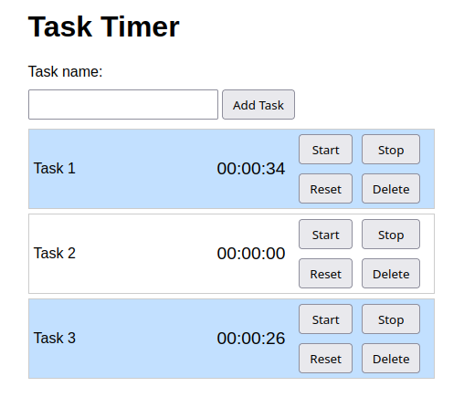

# TaskTimer

I wanted to try out if ChatGPT could write a (IMHO) simple application for me.

Basically I want to track the time spent on multiple task via a timer. For this I wanted to add tasks with just a title and a start / stop button to start / stop the corresponding timer. It should run inside the browser and not persist data I don't need that.

Nothing fancy, it should just work in a first iteration and I'd be building upon that to do some tinkering with JavaScript.

Following you will find my escapades with ChatGPT in producing the basic code, as well as the improvements I made upon that product.

You can read about the evolution under [docs/ChatGPT](docs/chatgpt.md)